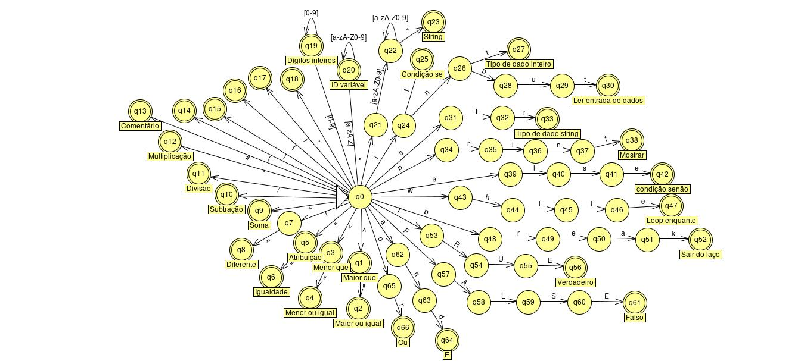
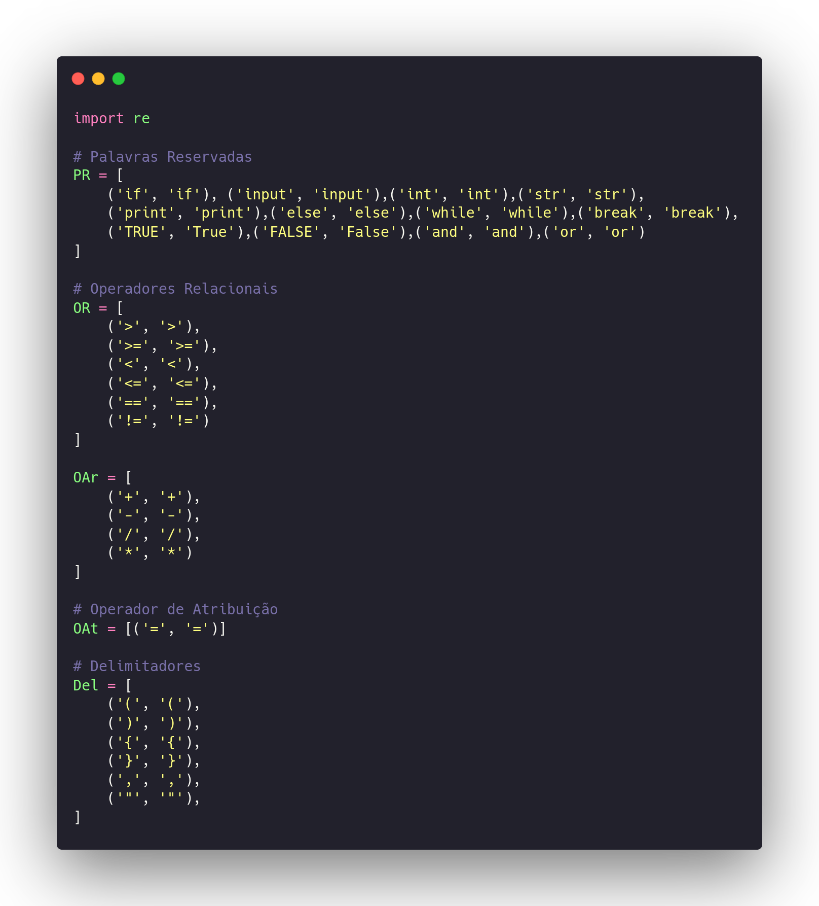
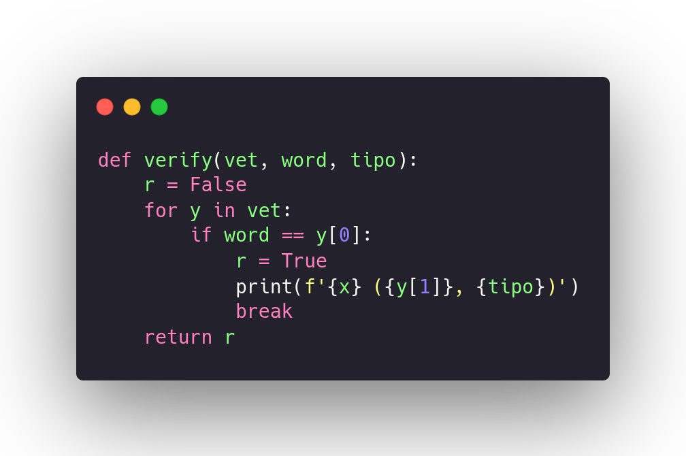
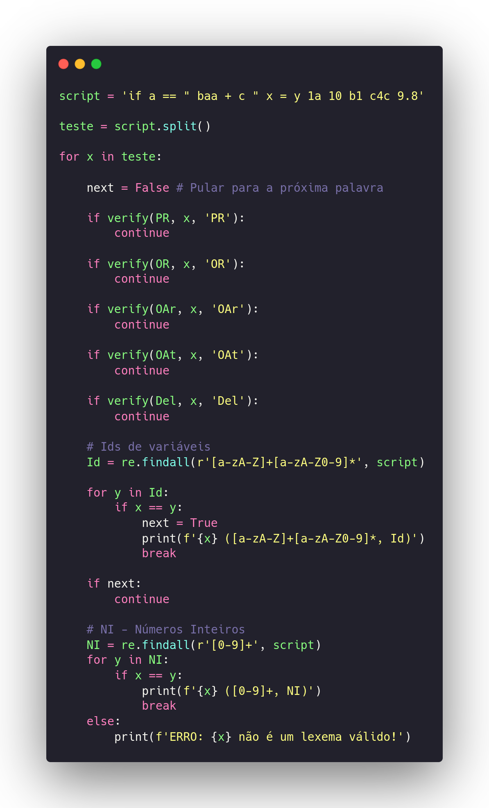
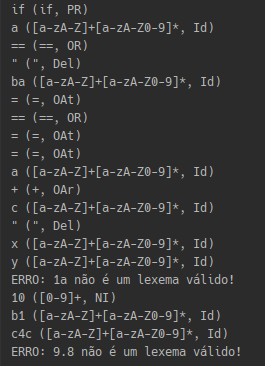

# Indentificador de Tokens 

### Introdução

Para resolver este problema, usamos a abordagem de filtrar cada palavra inserida e indentificar os tokens, para isso usamos expressões regulares.

### Autômato que marque a Linguagem

### Primeiros Passos

Para esta primeira etapa vamos definir as nossas palavras reservadas, operadores relacionais, aritmeticos, atribuição e os delimitadores.

### Indentificar lexemas válidos e mostrar tokens

Nesta etapa foi criado esta função que tem objetivo de indentificar os nossos lexemas válidos, se o lexema é valido mostra o token, caso contrario não é exibido.

# Teste

Nesta ultima etapa executamos um exemplo de teste para reconhecer uma palavra que está atribuída a variavel script que em seguida passa por um processo de split para pegar cada item da palavra, depois é identificado cada lexema e exibido os tokens, posteriormente exibida os ids das variaveis e por fim o tratamento das strings.

### Exemplo de Saída

Exemplo de saída para script = 'if a == " ba = == = = a + c " x,y 1a 10 b1 c4c 9.8'

### Conclusão

Nste trabalho foi utilizado uma abordagem bem simples e o autômato poderia ser otimizado para trabalhar em um cenario onde realmente o objetivo fosse criar um analisador léxico onde o motor seria uma maquina de turing e também usariamos orientação a objetos para ter o processo de emcapsulamento onde teriamos alguns objetos definidos no construtor como cabeça, fita, números de linhas e palavras reservadas. Para métodos algumas coisas como atualizador de estado, estado atual, avançar estado e outros metodos que o problema fosse exigir, metodos para cada estado a maquina de turing e claro alguns tratamentos de erros que viria deste da leitura do arquivo de texto ao fim do classe. 
